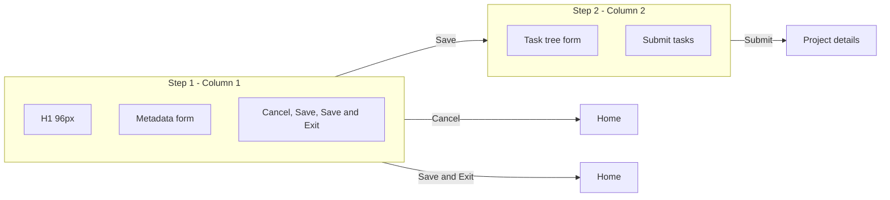

# Add project multi-step form refactor

## Current state

- [src/views/addProjectView.ts](src/views/addProjectView.ts): Single form with metadata + task tree; one submit creates project and all tasks, then navigates to project details.
- [src/styles/add-project.css](src/styles/add-project.css): Layout uses a 2-column grid at 900px+ with title spanning both columns; no step-based visibility or animation.

## Target behavior

| Step | Column   | Content                               | Actions                                                                                                             |
| ---- | -------- | ------------------------------------- | ------------------------------------------------------------------------------------------------------------------- |
| 1    | Column 1 | H1 (96px), metadata form              | **Cancel** → go to home page; **Save** → create project, reveal column 2; **Save & Exit** → create project, go home |
| 2    | Column 2 | Task tree (tasks / subtasks / nested) | Submit → create tasks for saved project, go to project details                                                      |

- **Cancel** is placed before **Save**; click navigates to home page (no save).
- Column 2 is hidden until the user clicks **Save** (step 1). After that, column 2 is shown with a left border and smooth animation.
- User can finish at step 1 with **Save & Exit** (no tasks) or continue in step 2 to add tasks then submit.

## Architecture

- **State**: After step-1 **Save**, keep the created `projectId` in a variable in `renderAddProjectView` (no URL change). If the user refreshes after revealing step 2, they land back on a fresh add-project form (acceptable; optional later: `#/add-project/:id` for step 2).
- **Cancel**: Call `goToHome()` (no project created).
- **Save & Exit**: Call `createProject` with form data, then `goToHome()`.
- **Save**: Call `createProject`, store `projectId`, show column 2 with animation, keep form mounted.
- **Step 2 submit**: Call `createTasksRecursive(projectId, tasks, null)`, then `goToProject(projectId)`.

## Implementation

### 1. View and DOM structure ([src/views/addProjectView.ts](src/views/addProjectView.ts))

- Replace the single form with a two-column layout:
  - **Column 1** (always visible): wrapper containing:
    - H1 "Add project" with fixed height 96px (e.g. `min-height: 96px` and alignment as needed).
    - Metadata section only (name, description, start/end date, status, priority).
    - Footer with three buttons in order: **Cancel** (navigate to home), **Save** (primary), **Save & Exit** (secondary).
  - **Column 2** (hidden by default, revealed after first save): wrapper with:
    - Task tree section (existing header "Tasks" + "Add task" + `tasksContainer`).
    - Footer with single **Save project** (or "Done" / "Save tasks") that submits tasks and navigates to project.
- Add a data attribute or class on the column-2 wrapper (e.g. `add-project-step2` or `data-step="2"`) and a class like `add-project-step2-visible` when step 2 is shown. Use this for both layout and animation (see below).
- **Cancel**: click handler calls `goToHome()`.
- **Save** (step 1): prevent default, validate metadata, call `createProject`, store returned `project.id`, add the "visible" class to column 2, optionally focus column 2 or first control for a11y.
- **Save & Exit**: same validation and `createProject`, then `goToHome()`.
- **Step 2 submit**: use the stored `projectId`, run `createTasksRecursive(projectId, tasks, null)`, then `goToProject(projectId)`. Disable submit button while saving.
- Keep existing task-draft helpers (`TaskDraft`, `replaceDraft`, `removeDraft`, `findParent`, `findDraft`, `appendSubtask`, `newTaskDraft`, `setDefaultDates`), `renderTaskList`, `refreshTaskTree`, `bindTaskTreeEvents`, and `createTasksRecursive`; only the wiring and DOM change (metadata vs tasks split, when each submit runs).

### 2. Layout and styles ([src/styles/add-project.css](src/styles/add-project.css))

- **Shell**: Use a two-column grid for the add-project main content (e.g. column 1 fixed or min width, column 2 `1fr`). Column 2 starts with `width: 0` (or `max-width: 0`) and `overflow: hidden` when step 2 is not visible, and transitions to normal width when `add-project-step2-visible` is set. Alternative: column 2 has `opacity: 0` and `transform` (e.g. `translateX(-10px)`) when hidden, and `opacity: 1` + `transform: none` when visible—smooth animation (e.g. 300–400ms ease-out).
- **H1**: Apply `min-height: 96px` (and if needed `display: flex; align-items: center`) so the title area is 96px as specified.
- **Column 2**: Add `border-left` (e.g. 1px solid `var(--border)` or existing border color) on the column-2 wrapper so the divider appears when the column is visible.
- **Animation**: Use a single class toggle (`add-project-step2-visible`) and CSS transitions on the column-2 wrapper for `opacity`, `transform`, and optionally `max-width`/`width` so revealing step 2 is smooth. Prefer opacity + transform for a simple, performant animation; if you use width, ensure the content doesn't overflow during transition (e.g. `overflow: hidden` on the column).
- Remove or adjust the current 900px grid that put metadata and tasks side-by-side so it aligns with the new step-based column visibility.
- **Footer**: Order buttons left-to-right as Cancel, Save, Save & Exit (e.g. flex with gap; Cancel can be `margin-right: auto` or first in order).

### 3. Small UX details

- When step 2 is revealed, ensure the "Add task" and task tree are visible and the primary action is clear (e.g. "Save project" or "Done" in column 2).
- Optional: after **Save** (step 1), disable or hide the **Save & Exit** button to avoid creating a second project; or keep both and make **Save & Exit** only create a project if we haven't already (idempotent). Recommended: once step 2 is visible, change **Save & Exit** to "Back to home" (navigate without creating again) and keep **Save** as no-op or remove it from step 1 once step 2 is visible—clarify in copy so the user knows they already saved.
- **Recommended**: After first **Save**, replace step-1 buttons with a single "Back to home" (or keep "Save & Exit" but have it just call `goToHome()` since project already exists). That avoids duplicate projects and keeps the mental model clear.

## File changes summary

| File                                                       | Changes                                                                                                                                                                                                                                                                                                                                            |
| ---------------------------------------------------------- | -------------------------------------------------------------------------------------------------------------------------------------------------------------------------------------------------------------------------------------------------------------------------------------------------------------------------------------------------- |
| [src/views/addProjectView.ts](src/views/addProjectView.ts) | Split form into column 1 (H1 + metadata + Cancel, Save, Save & Exit) and column 2 (task tree + submit). Add step state (`projectId`, step2Visible). Wire Cancel → goToHome(); Save → createProject + show column 2; Save & Exit → createProject + goToHome(); step 2 submit → createTasksRecursive + goToProject. Use class for step-2 visibility. |
| [src/styles/add-project.css](src/styles/add-project.css)   | Two-column layout; H1 min-height 96px; column 2 with border-left and hidden-by-default state; transitions for opacity/transform (or width) when toggling step-2-visible class; footer button order: Cancel, Save, Save & Exit.                                                                                                                     |

## Optional follow-ups

- **URL for step 2**: Use `#/add-project/:projectId` when revealing step 2 so refresh keeps the user in "add tasks to project X" (would require router and view changes to accept optional `projectId`).
- **Back from step 2**: "Back" button in step 2 that hides column 2 again (metadata already saved; could offer "Edit project" later via `updateProject` and a modal or inline edit).

